# 📘 Dokumentasi Aplikasi — OxygenApp (Oxygen Madani App)

> Sistem manajemen & pelacakan (tracking) tabung oksigen berbasis **barcode/QR scan**.
>
> Dokumen ini hanya mencakup dua komponen aktif:
> - **`MobileApp/`** → **Frontend (FE)** — aplikasi mobile React Native + Expo.
> - **`backend/`** → **Backend (BE)** — REST API Node.js (Express) + MySQL.
>
> Penyajian disusun dari **gambaran besar (high-level)** lalu menurun ke **detail per-fitur** (flowchart + pseudocode + use case).

---

## Daftar Isi

1. [Penjelasan Aplikasi](#1-penjelasan-aplikasi)
2. [Tujuan Aplikasi](#2-tujuan-aplikasi)
3. [Teknologi (Tech Stack)](#3-teknologi-tech-stack)
4. [Struktur Direktori FE & BE](#4-struktur-direktori-fe--be)
5. [Arsitektur & Gambaran Besar Sistem](#5-arsitektur--gambaran-besar-sistem)
6. [Model Data (Database)](#6-model-data-database)
7. [Status Tabung & Daur Hidupnya](#7-status-tabung--daur-hidupnya)
8. [Daftar Endpoint API](#8-daftar-endpoint-api)
9. [Peran Pengguna (Roles)](#9-peran-pengguna-roles)
10. [Flowchart Besar (End-to-End)](#10-flowchart-besar-end-to-end)
11. [Detail Per-Fitur](#11-detail-per-fitur)
    - [11.1 Login / Autentikasi](#111-login--autentikasi)
    - [11.2 Dashboard](#112-dashboard)
    - [11.3 Scan Keluar (Peminjaman Tabung)](#113-scan-keluar-peminjaman-tabung)
    - [11.4 Approval / Persetujuan (Supervisor)](#114-approval--persetujuan-supervisor)
    - [11.5 Scan Masuk (Pengembalian Tabung)](#115-scan-masuk-pengembalian-tabung)
    - [11.6 Tambah Tabung Baru](#116-tambah-tabung-baru)
    - [11.7 Daftar Tabung & Riwayat (History Log)](#117-daftar-tabung--riwayat-history-log)
    - [11.8 Notifikasi](#118-notifikasi)
12. [Ringkasan Use Case](#12-ringkasan-use-case)
13. [Catatan Teknis & Rekomendasi](#13-catatan-teknis--rekomendasi)

---

## 1. Penjelasan Aplikasi

**OxygenApp** adalah aplikasi mobile beserta backend yang digunakan untuk **mengelola sirkulasi tabung oksigen** di sebuah fasilitas kesehatan (RS "Madani"). Setiap tabung oksigen ditempeli **barcode/QR code** sebagai identitas unik.

Melalui kamera HP, **Petugas** dapat:

- **Mendaftarkan** tabung baru ke sistem,
- **Meminjamkan / mengeluarkan** tabung ke ruangan tertentu (Scan Keluar),
- **Mengembalikan** tabung (Scan Masuk).

Sementara **Supervisor (SPV)** bertugas **menyetujui / menolak** permintaan peminjaman. Seluruh aktivitas tercatat dalam **log riwayat (`tank_logs`)** sehingga posisi dan status setiap tabung dapat dilacak kapan saja.

---

## 2. Tujuan Aplikasi

| No  | Tujuan                          | Penjelasan                                                                                   |
| --- | ------------------------------- | -------------------------------------------------------------------------------------------- |
| 1   | **Inventarisasi tabung**        | Mengetahui jumlah total tabung beserta statusnya (Ready / Proses / Keluar).                  |
| 2   | **Pelacakan posisi & status**   | Tahu tabung mana sedang dipinjam, di ruangan mana, dan mana yang tersedia.                   |
| 3   | **Kontrol peminjaman**          | Peminjaman harus melewati persetujuan Supervisor agar tidak ada tabung keluar tanpa catatan. |
| 4   | **Audit trail / akuntabilitas** | Setiap perubahan status menghasilkan log (apa, kapan, keterangan apa).                       |
| 5   | **Efisiensi operasional**       | Cukup scan kamera, mengurangi pencatatan manual yang rawan salah.                            |

---

## 3. Teknologi (Tech Stack)

### Frontend — `MobileApp/`

| Komponen               | Teknologi                                                          |
| ---------------------- | ------------------------------------------------------------------ |
| Framework              | React Native 0.79 + Expo SDK 53                                    |
| Bahasa / Runtime       | JavaScript, React 19                                               |
| Routing                | expo-router (file-based routing)                                   |
| Kamera / Scan          | expo-camera                                                        |
| Penyimpanan token aman | expo-secure-store                                                  |
| State auth global      | React Context (`AuthContext.js`)                                   |
| Komponen UI tambahan   | `@react-native-picker/picker`, `@expo/vector-icons`                |
| Pola arsitektur        | MVC: `view/` (markup) → `controller/` (handler) → `app/` (routing) |

### Backend — `backend/`

| Komponen         | Teknologi                                                             |
| ---------------- | --------------------------------------------------------------------- |
| Runtime          | Node.js (ESM, `"type": "module"`)                                     |
| Framework        | Express 5                                                             |
| Database         | MySQL (driver `mysql2/promise`, connection pool)                      |
| Autentikasi      | JWT (`jsonwebtoken`, expired 7 hari)                                  |
| Hashing password | bcrypt                                                                |
| Lain-lain        | cors, dotenv, body-parser, nodemon                                    |
| Pola arsitektur  | MVC berlapis: `routes/` → `Controllers/` → `Models/` → `Config/db.js` |

---

## 4. Struktur Direktori FE & BE

```text
MobileApp/                      # ===== FRONTEND =====
├── app/                        # Routing (expo-router)
│   ├── index.js                # Redirect awal -> /login
│   ├── _layout.js              # Root layout + AuthProvider
│   ├── login.js                # Halaman login
│   ├── (protected)/            # Grup halaman butuh login
│   │   ├── _layout.js          # Guard: redirect ke /login jika belum auth
│   │   ├── dashboard.js
│   │   ├── aprove.js
│   │   ├── notifikasi.js
│   │   └── daftarTabung.js
│   └── component/Scan/         # Komponen scanner (in/out/insert)
├── view/                       # Markup / tampilan (UI murni)
├── controller/                 # Handler / logika (fetch ke BE)
├── config/config.js            # Base URL API (DEV_URL)
├── AuthContext.js              # Context auth + SecureStore
└── assets/, style/

backend/                        # ===== BACKEND =====
├── server.js                   # Entry point Express
├── routes/                     # Definisi endpoint (/api/...)
├── Controllers/                # Logika request/response
├── Models/                     # Query ke MySQL
├── Middleware/                 # authMiddlewares.js (verifikasi JWT)
├── Config/db.js                # Connection pool MySQL
├── helpers/, Service/          # Util & service pendukung
└── .env                        # Kredensial DB & JWT_SECRET
```

---

## 5. Arsitektur & Gambaran Besar Sistem

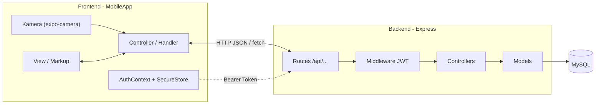

**Alur umum:** UI memanggil *handler* → *handler* melakukan `fetch()` ke endpoint `/api/...` → *route* meneruskan ke *controller* → *controller* memanggil *model* → *model* query ke MySQL → hasil dikembalikan berlapis sampai ke UI.

---

## 6. Model Data (Database)

Skema diambil dari dump `oxygenapp.sql` (dengan penyesuaian sesuai kode terbaru).

| Tabel       | Fungsi                          | Kolom penting                                                                                                                                         |
| ----------- | ------------------------------- | ----------------------------------------------------------------------------------------------------------------------------------------------------- |
| `users`     | Akun pengguna                   | `id`, `username`, `password` (hashed), `role` (admin/petugas/spv), `created_at`                                                                       |
| `tabung`    | Data tabung oksigen             | `id`, `barcode`, `no_seri`, `tabung_status`, `input_date`, `create_by`, `received_from`                                                               |
| `locations` | Ruangan tujuan                  | `id`, `RoomCode`, `name`                                                                                                                              |
| `approve`   | Permintaan & status persetujuan | `id`, `barcode_id`, `Approved_CreateBy`, `Approved_byId`, `id_locations`, `Remarks`, `Approval_status`, `req_aprove`, `Approval_date`, `createDelete` |
| `tank_logs` | Riwayat aktivitas tabung        | `id`, `tabung_id`, `approve_id`, `remarks`, `date_Activty`                                                                                            |
| `reports`   | (Disiapkan untuk fitur laporan) | `id`, `filename`, `report_type`, `start_date`, `end_date`                                                                                             |

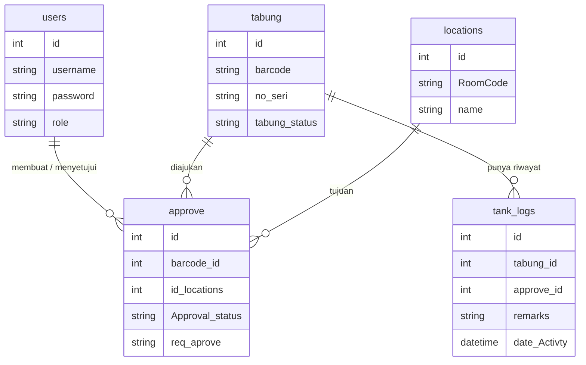

---

## 7. Status Tabung & Daur Hidupnya

Nilai `tabung.tabung_status` yang dipakai sistem:

| Status    | Arti                                     |
| --------- | ---------------------------------------- |
| `Ready`   | Tabung tersedia, siap dipinjam           |
| `Prosses` | Menunggu persetujuan Supervisor          |
| `Out`     | Sudah disetujui & sedang keluar/dipinjam |

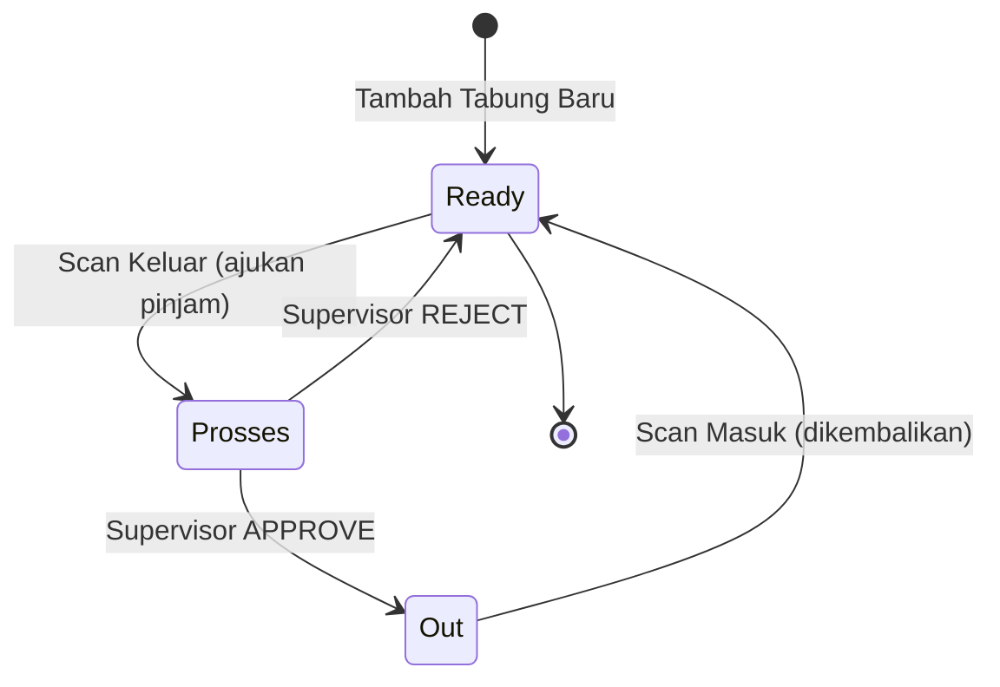

---

## 8. Daftar Endpoint API

Base prefix: **`/api`** (port default `3000`).

| Method | Endpoint                         | Fungsi                                  | Controller                                       |
| ------ | -------------------------------- | --------------------------------------- | ------------------------------------------------ |
| POST   | `/login`                         | Login + menerima JWT                    | `authControllers.loginController`                |
| GET    | `/protected`                     | Contoh route ber-proteksi JWT           | `authMiddlewares`                                |
| GET    | `/ping`                          | Health check server                     | `pingServer.ping`                                |
| GET    | `/getBarcode?barcode=`           | Validasi data tabung dari barcode       | `insertScanAproveControllers.getBarcode`         |
| GET    | `/getLocationsName`              | Ambil daftar ruangan                    | `scanOutController.getLocationName`              |
| POST   | `/insertOutScan`                 | Ajukan peminjaman (scan keluar)         | `insertScanAproveControllers.insertScanOut`      |
| POST   | `/insertInscan`                  | Catat pengembalian (scan masuk)         | `insertScanAproveControllers.insertScanIn`       |
| POST   | `/insertTank`                    | Tambah tabung baru                      | `crudTankControllers.insertTankController`       |
| GET    | `/getNotif`                      | Daftar permintaan yang perlu di-approve | `aproveControllers.getNotifData`                 |
| POST   | `/postData`                      | Aksi approve/reject oleh Supervisor     | `aproveControllers.eventButtonNotifikasi`        |
| POST   | `/getNotifikasi`                 | Notifikasi aktivitas                    | `notifikasiControllers.notifikasiController`     |
| GET    | `/getDaftarLogsTabung`           | Riwayat seluruh aktivitas tabung        | `getHistoryController.historyGet`                |
| GET    | `/getStatusTabung?statusTabung=` | Daftar tabung berdasarkan status        | `getHistoryController.getStatusTabungController` |
| GET    | `/totalTabung`                   | Hitung total & rekap per status         | `getHistoryController.getCountTabung`            |

---

## 9. Peran Pengguna (Roles)

Enum `users.role`: `admin`, `petugas`, `spv`.

| Role                 | Hak akses utama                                                                              |
| -------------------- | -------------------------------------------------------------------------------------------- |
| **petugas**          | Scan keluar (ajukan pinjam), scan masuk (kembalikan), tambah tabung, lihat daftar tabung.    |
| **spv** (Supervisor) | Semua hak petugas **+** menyetujui/menolak permintaan peminjaman (`/getNotif`, `/postData`). |
| **admin**            | Peran administratif (tersedia di skema).                                                     |

Role dibaca dari `user.role` pada `AuthContext` dan dipakai dashboard untuk menampilkan menu yang relevan.

---

## 10. Flowchart Besar (End-to-End)

Alur lengkap satu tabung dari pendaftaran hingga kembali tersedia:

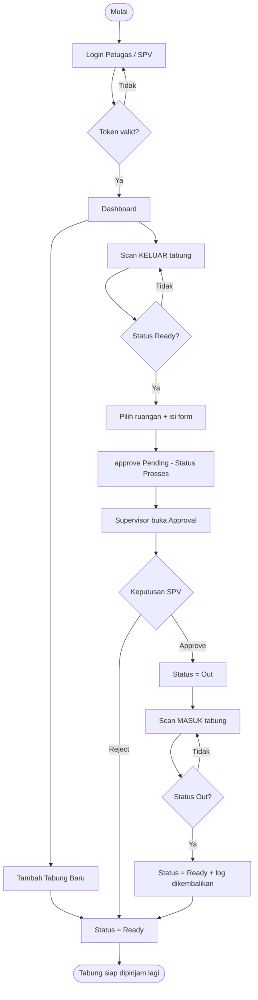

---

## 11. Detail Per-Fitur

Setiap fitur disajikan dengan format: **Tujuan → Flowchart → Pseudocode → Use Case**.

---

### 11.1 Login / Autentikasi

**Tujuan:** Memverifikasi identitas pengguna dan memberi JWT untuk akses fitur ber-proteksi.

**Flowchart:**

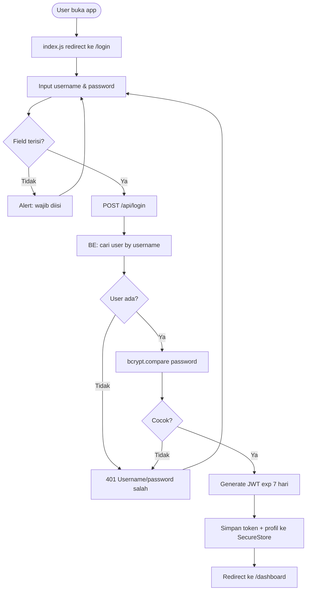

**Pseudocode — Backend (`loginController`):**

```text
FUNGSI login(userName, pass):
    JIKA userName kosong ATAU pass kosong:
        KEMBALIKAN 400 "wajib diisi"

    user = SELECT * FROM users WHERE username = userName
    JIKA user tidak ada:
        KEMBALIKAN 401 "username/password salah"

    JIKA BUKAN bcrypt.compare(pass, user.password):
        KEMBALIKAN 401 "username/password salah"

    hapus field password dari objek user
    token = JWT.sign({id, username}, SECRET, exp=7d)
    KEMBALIKAN 200 { data: user, token }
```

**Pseudocode — Frontend (`useLoginHandler`):**

```text
FUNGSI handleLogin():
    trim username
    JIKA username/password kosong: alert; berhenti
    response = POST DEV_URL/login { userName, pass }
    JIKA response.ok:
        SecureStore.set('userData', {token, username, role, id})
        AuthContext.login(userData)
        router.replace('/dashboard')
    SELAIN ITU:
        alert(pesan error)
```

**Use Case:**

- **Aktor:** Petugas / Supervisor
- **Pra-kondisi:** Akun terdaftar di tabel `users`.
- **Skenario sukses:** kredensial benar → masuk dashboard.
- **Skenario gagal:** salah password → tetap di login dengan pesan error; server mati → alert "Server Problems".

---

### 11.2 Dashboard

**Tujuan:** Pusat navigasi setelah login; memilih mode scan (Masuk / Keluar / Tambah) dan logout.

**Flowchart:**

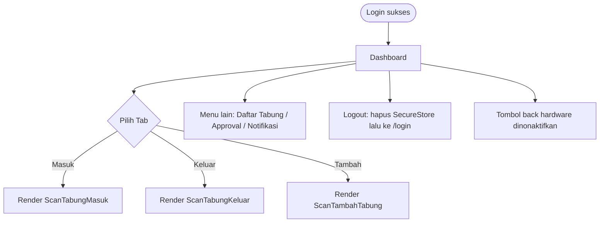

**Pseudocode (`useDashboardController`):**

```text
state activeTab = 'masuk'
isRoles = user.role
nonaktifkan tombol back perangkat

renderScanner():
    PILIH activeTab:
        'masuk'  -> <ScanTabungMasuk/>
        'keluar' -> <ScanTabungKeluar/>
        'tambah' -> <ScanTambahTabung/>

handleLogout():
    hapus token di SecureStore
    AuthContext.logout()
    router.replace('/login')
```

**Use Case:**

- **Aktor:** Petugas / Supervisor
- **Tujuan:** Berpindah cepat antar fitur scan & menu manajemen.
- **Catatan:** Tombol back perangkat dimatikan agar user tidak keluar sesi secara tidak sengaja.

---

### 11.3 Scan Keluar (Peminjaman Tabung)

**Tujuan:** Mengajukan peminjaman tabung. Tabung berstatus `Ready` di-scan, dipilih ruangan tujuannya, lalu masuk antrian persetujuan (`Prosses`).

**Flowchart:**

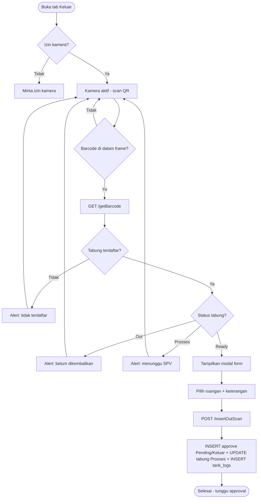

**Pseudocode — Backend (`insertScanOut` + `insertAproveScan`):**

```text
FUNGSI insertScanOut(data):   // data: {barcode, created_by, location_id}
    result = insertAproveScan(data)
    log    = LogInsertTabungOut(data.barcode)
    JIKA result.success DAN log.success:
        KEMBALIKAN 201 "data berhasil dikirim"
    SELAIN ITU:
        KEMBALIKAN 401 "gagal insert"

FUNGSI insertAproveScan(data):
    idBarcode = SELECT id FROM tabung WHERE barcode = data.barcode
    INSERT INTO approve (barcode_id, Approved_CreateBy, id_locations,
        Remarks = "PERMINTAAN PEMINJAMAN TABUNG",
        Approval_status = "Pending", req_aprove = "Keluar", Approval_date = NOW())
    UPDATE tabung SET tabung_status = "Prosses" WHERE barcode = data.barcode
```

**Use Case:**

- **Aktor:** Petugas
- **Pra-kondisi:** Tabung berstatus `Ready`.
- **Skenario sukses:** scan → pilih ruangan → kirim → status menjadi `Prosses`.
- **Skenario alternatif:** tabung `Out` / `Prosses` / tak terdaftar → ditolak dengan alert, scan dibatalkan (`resetScan`).

---

### 11.4 Approval / Persetujuan (Supervisor)

**Tujuan:** Supervisor meninjau permintaan peminjaman lalu **menyetujui** (tabung → `Out`) atau **menolak** (tabung kembali `Ready`).

**Flowchart:**

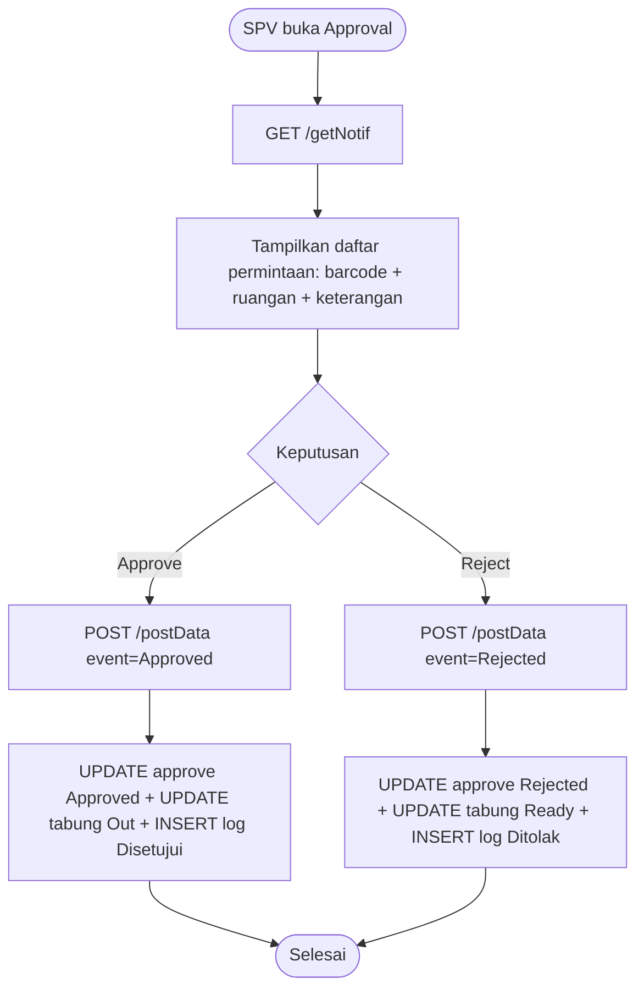

**Pseudocode — Backend (`eventButtonNotifikasi`):**

```text
FUNGSI eventButtonNotifikasi(data):   // {barcode, event, id, idUser}
    ok = updateAprove(data)   // set Remarks, Approved_byId, status, createDelete = NOW()
    JIKA TIDAK ok: KEMBALIKAN 400 "gagal update approve"

    PARALEL:
        updateTabung(data)     // status = (event=Approved ? 'Out' : 'Ready')
        insertTankLogs(data)   // remarks sesuai keputusan
    KEMBALIKAN 200 "semua operasi berhasil"
```

**Use Case:**

- **Aktor:** Supervisor
- **Pra-kondisi:** Ada permintaan `req_aprove = 'Keluar'` dengan `createDelete IS NULL`.
- **Skenario approve:** status tabung → `Out`, tercatat di log.
- **Skenario reject:** status tabung dikembalikan `Ready`.

---

### 11.5 Scan Masuk (Pengembalian Tabung)

**Tujuan:** Mencatat tabung yang dikembalikan. Tabung berstatus `Out` di-scan → status kembali `Ready` dan dibuat catatan pengembalian.

**Flowchart:**

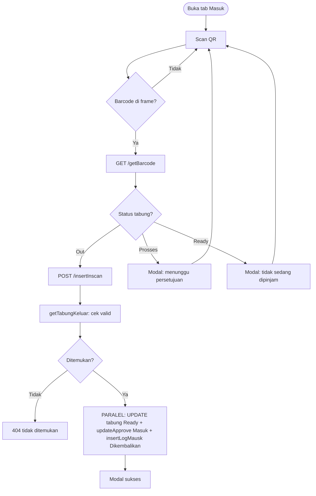

**Pseudocode — Backend (`insertScanIn`):**

```text
FUNGSI insertScanIn(req):   // body: {barcode, user_id}
    TabungKeluar = getTabungKeluar({barcode})   // SELECT tabung status 'Out' lalu filter barcode
    JIKA kosong: KEMBALIKAN 404 "tabung keluar tidak ditemukan"

    PARALEL:
        updateTabung(barcode)        // status -> 'Ready'
        updateApprove(body)          // INSERT approve 'Masuk' / 'Approved'
        insertLogMausk(barcode)      // INSERT tank_logs 'DiKembalikan'
    KEMBALIKAN 200 "berhasil diupdate"
```

**Use Case:**

- **Aktor:** Petugas
- **Pra-kondisi:** Tabung berstatus `Out`.
- **Skenario sukses:** scan → status `Ready` → modal sukses.
- **Skenario alternatif:** status `Prosses` / `Ready` → modal informasi, tidak diproses.

> ⚠️ Endpoint backend bernama `/insertInscan`, namun handler `scanIn.handler.js` memanggil `/insertInScan` (beda kapital). Lihat [Catatan Teknis](#13-catatan-teknis--rekomendasi).

---

### 11.6 Tambah Tabung Baru

**Tujuan:** Mendaftarkan tabung baru (barcode + nomor seri) ke sistem dengan status awal `Ready`.

**Flowchart:**

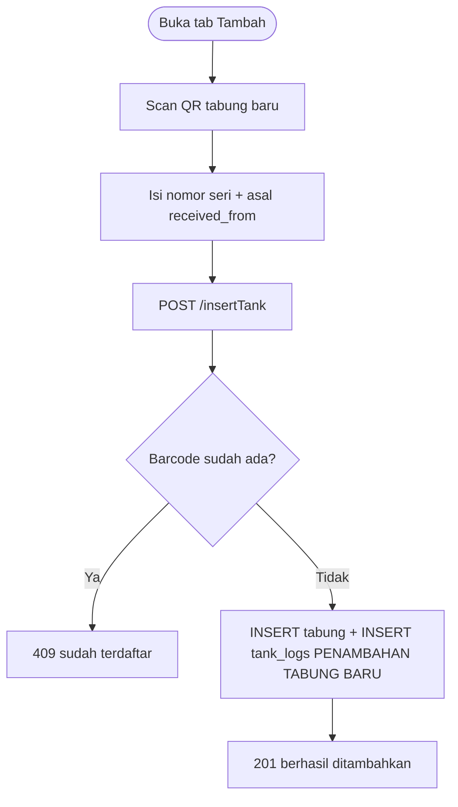

**Pseudocode — Backend (`insertTankController`):**

```text
FUNGSI insertTankController(data):   // {qRcode, nomorSeri, receivedFrom, userId}
    result = insertTankModels(data)   // INSERT INTO tabung (...)
    log    = LogInsertTabung(data.qRcode)
    JIKA gagal:
        JIKA error == "barcode sudah ada": KEMBALIKAN 409
        SELAIN ITU: KEMBALIKAN 400
    KEMBALIKAN 201 { tabung, log }
```

**Use Case:**

- **Aktor:** Petugas
- **Pra-kondisi:** Tabung fisik baru dengan QR belum terdaftar.
- **Skenario sukses:** tabung tercatat, langsung berstatus `Ready`.
- **Skenario gagal:** barcode duplikat → 409.

---

### 11.7 Daftar Tabung & Riwayat (History Log)

**Tujuan:** Menampilkan rekap jumlah tabung, daftar tabung per status, dan riwayat lengkap aktivitas.

**Flowchart:**

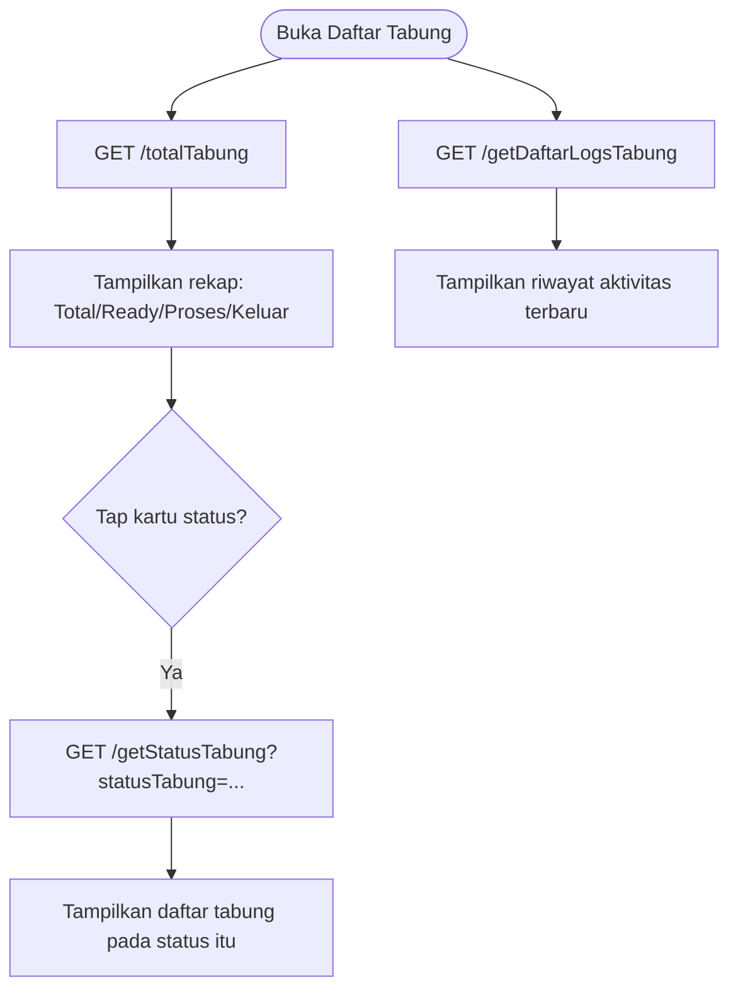

**Pseudocode — Backend:**

```text
getCountStatusTabung():
    KEMBALIKAN COUNT total, Ready, Prosses, Out FROM tabung

getHistory():
    KEMBALIKAN JOIN tank_logs + tabung ORDER BY date_Activty DESC

getStatusTabung(status):
    KEMBALIKAN tabung WHERE tabung_status = status
        + remarks log terbaru (ROW_NUMBER per tabung)
```

**Pseudocode — Frontend (`getLogsTabung`):**

```text
FUNGSI getLogsTabung():
    pasang timeout 5 detik (AbortController)
    response = fetch(/getDaftarLogsTabung)
    validasi: response.ok, content-type JSON, data berupa array
    KEMBALIKAN result   // jika error: {error:true, message, status}
```

**Use Case:**

- **Aktor:** Petugas / Supervisor
- **Tujuan:** Memantau inventaris & menelusuri riwayat satu tabung.
- **Catatan:** Request riwayat memiliki timeout 5 detik dan validasi tipe response yang ketat.

---

### 11.8 Notifikasi

**Tujuan:** Menampilkan informasi aktivitas tabung (mis. peminjaman yang telah diproses, beserta ruangan & user).

**Flowchart:**

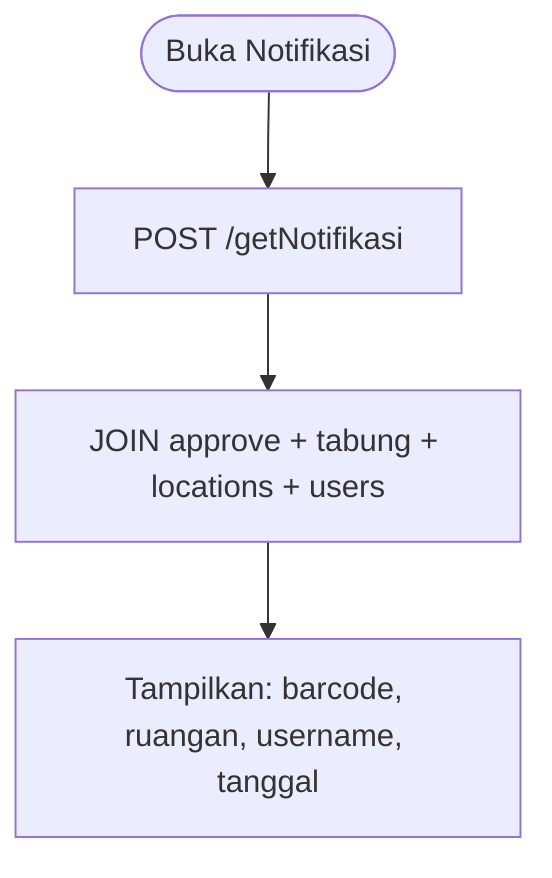

**Pseudocode — Backend (`getNotifikasi`):**

```text
getNotifikasi():
    KEMBALIKAN SELECT barcode, location.name, user.username, Approval_date
               FROM approve
               JOIN tabung, locations, users
```

**Use Case:**

- **Aktor:** Petugas / Supervisor
- **Tujuan:** Melihat ringkasan aktivitas terkait tabung & siapa yang menangani.

> ⚠️ Di `notifikasiModels.js` query masih memakai nama tabel lama `aprove` (satu "p") dan controller memanggil `getNotifikasi()` **tanpa `await`**. Lihat [Catatan Teknis](#13-catatan-teknis--rekomendasi).

---

## 12. Ringkasan Use Case

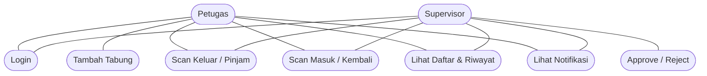

| Use Case         | Aktor        | Hasil Akhir                               |
| ---------------- | ------------ | ----------------------------------------- |
| Login            | Petugas, SPV | Dapat JWT, masuk dashboard                |
| Tambah Tabung    | Petugas      | Tabung baru `Ready`                       |
| Scan Keluar      | Petugas      | Tabung `Prosses`, masuk antrian approval  |
| Approve / Reject | SPV          | Tabung `Out` (approve) / `Ready` (reject) |
| Scan Masuk       | Petugas      | Tabung `Ready`, tercatat dikembalikan     |
| Daftar & Riwayat | Petugas, SPV | Rekap inventaris & audit trail            |
| Notifikasi       | Petugas, SPV | Ringkasan aktivitas                       |

---

## 13. Catatan Teknis & Rekomendasi

Temuan dari pembacaan kode FE & BE (untuk perbaikan ke depan):

| #   | Temuan                                                                                      | Dampak                                     | Rekomendasi                                     |
| --- | ------------------------------------------------------------------------------------------- | ------------------------------------------ | ----------------------------------------------- |
| 1   | Inkonsistensi nama endpoint scan masuk: backend `/insertInscan` vs frontend `/insertInScan` | Scan masuk bisa gagal (404)                | Samakan penamaan endpoint.                      |
| 2   | Inkonsistensi nama tabel `approve` vs `aprove` (di `notifikasiModels.js`)                   | Query notifikasi bisa error                | Pakai satu nama tabel konsisten.                |
| 3   | `notifikasiController` memanggil model tanpa `await`                                        | Mengembalikan Promise, bukan data          | Tambahkan `await`.                              |
| 4   | `config.js` memakai IP lokal hardcoded (sering berganti)                                    | Susah deploy / produksi                    | Pindahkan ke variabel lingkungan (`.env`).      |
| 5   | Backend masih HTTP (`usesCleartextTraffic: true`), folder `ssl/` masih kosong               | Tidak aman untuk produksi                  | Aktifkan HTTPS di produksi.                     |
| 6   | `/getNotif`, `/postData`, dan endpoint scan tidak dilindungi middleware JWT                 | Endpoint sensitif bisa diakses tanpa token | Pasang `authenticateToken` pada route ber-aksi. |
| 7   | Tabel `reports` ada, tetapi fitur laporan (`download-laporan.js`) masih placeholder         | Fitur belum berfungsi                      | Implementasikan endpoint & UI laporan.          |

---

> 📄 *Dokumen ini disusun berdasarkan analisis kode sumber `backend/` (Express + MySQL) dan `MobileApp/` (React Native + Expo) pada repository `oxygenMadaniApp`.*
